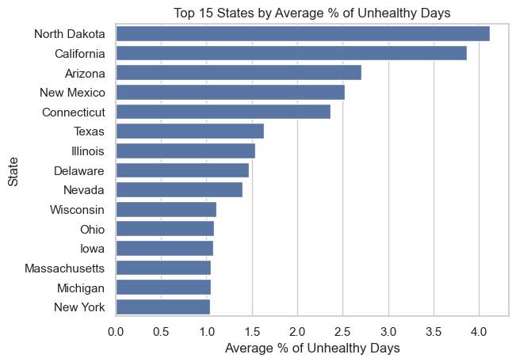
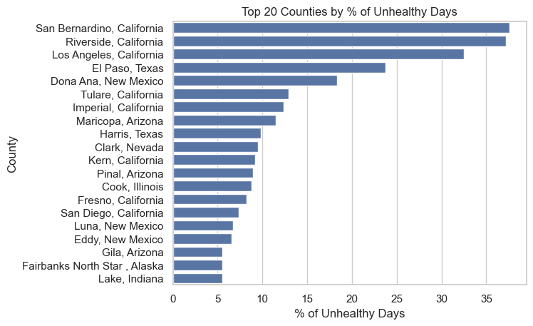
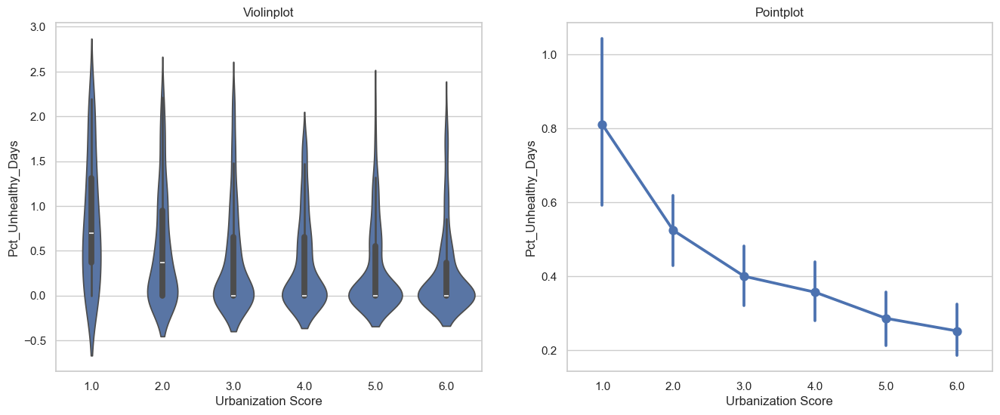
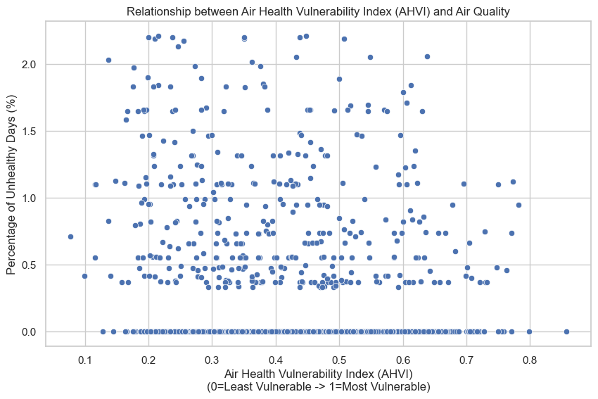
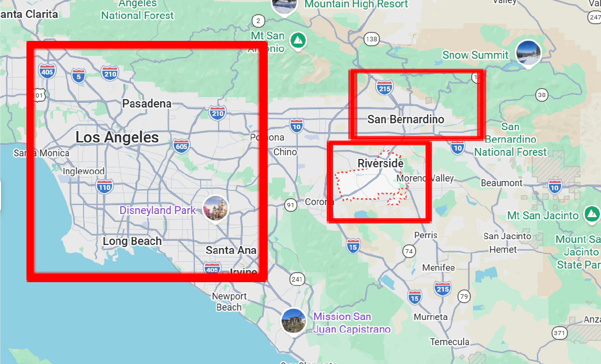

# Air Quality and Health in the United States

**Hyundam Choi · Yunchae Lee · Gyuryang Lee** — Datathon 2026 · [Full report (PDF)](Report.pdf) · [Interactive Tableau map](https://public.tableau.com/shared/XGGXP5N4T?:display_count=n&:origin=viz_share_link)

Bad air is a risk for everyone, but how much harm it does depends on who is breathing it. Using the EPA's 2025 county-level Air Quality Index (AQI) data, this project asks two questions:

1. **How does air quality vary with urbanization?**
2. **Where could poor air quality have the most severe health impact?** To answer this, we built a new metric, the Air Health Vulnerability Index (AHVI), from the CDC's Social Vulnerability Index.

## TL;DR

- **Unhealthy air is concentrated in a few places.** In 2025, 52% of monitored counties had no unhealthy air days at all, while San Bernardino, Riverside, and Los Angeles counties had unhealthy air on 32–38% of monitored days.
- **Cities have worse air.** The most urban counties averaged about 3× the share of unhealthy days of the most rural ones (0.81% vs. 0.25%, typical counties).
- **Rural counties are the most vulnerable.** By AHVI, rural counties in Texas, Oklahoma, and Missouri are the most biologically and economically sensitive to bad air.
- **Where exposure and vulnerability meet:** a risk score (% unhealthy days × AHVI) puts San Bernardino, El Paso, Riverside, and Los Angeles at the top. The Southern California counties are pulled up by extreme ozone pollution even though their AHVI is below the national median, and they also rank high on the overall Social Vulnerability Index.

## Data

| File | Source | Used for |
|---|---|---|
| `AQI.csv` | [EPA Annual AQI by County](https://aqs.epa.gov/aqsweb/airdata/download_files.html), 2025 (provided by the datathon) | Air quality in every part |
| `urbanization.csv` | [NCHS Urban–Rural Classification Scheme](https://www.cdc.gov/nchs/data-analysis-tools/urban-rural.html) (2023 codes), 3,144 counties | Q1 |
| `SVI.csv` | [CDC/ATSDR Social Vulnerability Index](https://www.atsdr.cdc.gov/place-health/php/svi/svi-data-documentation-download.html) (2022), 3,144 counties | Q2 |

- The AQI file has one row per county. Each row counts the days in every AQI category (Good, Moderate, Unhealthy for Sensitive Groups, Unhealthy, Very Unhealthy, Hazardous) and gives max, 90th-percentile, and median AQI, plus how many days each pollutant (CO, NO₂, ozone, PM2.5, PM10) was the main pollutant.
- After dropping Mexico and U.S. territories, **968 counties** remain, across all 50 states and DC. Only counties with air monitors are included, which is about a third of all U.S. counties.

**Key metric: % unhealthy days.** Counties are monitored on different numbers of days, so raw counts would be misleading. We counted every day at "Unhealthy for Sensitive Groups" (AQI above 100) or worse as an *unhealthy day* and divided by the number of days with an AQI measurement.

## Exploratory analysis

North Dakota had the highest average share of unhealthy days in 2025 (4.1%, from only 9 monitored counties), followed by California (3.9%), Arizona (2.7%), and New Mexico (2.5%).

At the county level, three Southern California counties stand far above the rest: **San Bernardino (37.6%), Riverside (37.2%), and Los Angeles (32.5%)**. They are followed by El Paso, TX (23.8%) and Doña Ana, NM (18.3%). California, Arizona, and New Mexico appear again and again in the top 20.

For a geographic view, see the **[interactive Tableau dashboard map](https://public.tableau.com/shared/XGGXP5N4T?:display_count=n&:origin=viz_share_link)**.

## Q1: How does air quality vary by urbanization level?

Cities concentrate traffic, people, and energy use, so we expected worse air in more urban counties. To test this, we joined each county's AQI data to the National Center for Health Statistics (NCHS) six-level urban–rural classification:

| Score | Category | Definition |
|---|---|---|
| 1 | Large central metro | Metro areas of 1M+ people, central counties |
| 2 | Large fringe metro | Metro areas of 1M+ people, outer counties |
| 3 | Medium metro | Metro areas of 250,000–999,999 people |
| 4 | Small metro | Metro areas of 50,000–249,999 people |
| 5 | Micropolitan | Counties in micropolitan statistical areas |
| 6 | Noncore | Did not qualify as micropolitan |

The two files spell names differently (state abbreviations vs. full names, "Parish", "Borough", "Census Area", and so on). We standardized both state and county names before a left join, which matched 953 of the 968 counties. We used both names as keys because a county name can also be a state name, like Washington.

The plots exclude 78 outlier counties with more than 2.24% unhealthy days (the 1.5 × IQR rule). The right panel shows means with 95% confidence intervals.

- **Big cities have more bad air days.** Large central metro counties have the highest median. The mean share of unhealthy days falls steadily as counties become more rural, from **0.81% (score 1) to 0.25% (score 6)**. The outliers left out of the plots are disproportionately urban (22 of the 60 large central metro counties), so the full data shows an even wider gap: 3.4% vs. 0.4%.
- **Urban air quality varies more.** Urban counties (scores 1–2) have taller interquartile ranges, so some large cities manage air quality well while others struggle. Rural counties (scores 3–6) are compressed near zero, meaning air quality is consistently good across most of them.

## Q2: Where could poor air quality hurt the most?

High pollution is a risk for everyone, but the health impact depends on how sensitive a community is and how well it can cope.

### A new metric: the Air Health Vulnerability Index (AHVI)

The CDC/ATSDR Social Vulnerability Index (SVI) was designed for disasters like floods and earthquakes. Its overall score weighs factors such as mobile-home residence and vehicle access that matter less for air pollution. So we built an index from the five SVI indicators most related to respiratory health:

| SVI indicator | Group | Why it matters for air quality |
|---|---|---|
| `EPL_AGE65` | Adults 65+ | High risk of respiratory failure |
| `EPL_AGE17` | Children 17 and under | Developing lungs are more susceptible to damage |
| `EPL_DISABL` | People with disabilities | May have pre-existing conditions |
| `EPL_POV150` | Below 150% of the poverty line | May lack resources such as high-quality masks or the ability to stay indoors |
| `EPL_UNINSUR` | Uninsured | Limited access to medical care |

Each `EPL_` value is the county's percentile rank (0 to 1) among all U.S. counties for that indicator, and AHVI is their average (0 = least vulnerable, 1 = most):

$$\mathrm{AHVI} = \frac{\mathrm{Age65} + \mathrm{Age17} + \mathrm{Disability} + \mathrm{Poverty150} + \mathrm{Uninsured}}{5}$$

AHVI is related to the overall SVI but measures something different (Pearson r = 0.62). For example, Cedar County, MO sits only in the 66th percentile of overall SVI, but its AHVI is the 4th highest in the country, in the 99.9th percentile. It looks moderately vulnerable in general, but its population makes air quality events much more dangerous there.

**Most vulnerable counties by AHVI**

| Rank | County | AHVI | Overall SVI |
|---|---|---|---|
| 1 | Kenedy County, TX | 0.935 | 0.668 |
| 2 | Real County, TX | 0.928 | 0.783 |
| 3 | Coal County, OK | 0.860 | 0.836 |
| 4 | Cedar County, MO | 0.857 | 0.664 |
| 5 | Oregon County, MO | 0.851 | 0.659 |
| 6 | Jefferson County, OK | 0.845 | 0.806 |
| 7 | Cottle County, TX | 0.841 | 0.673 |
| 8 | Presidio County, TX | 0.838 | 0.993 |
| 9 | Choctaw County, OK | 0.837 | 0.949 |
| 10 | Greene County, AL | 0.828 | 0.916 |

The most vulnerable places are rural counties in Texas, Oklahoma, and Missouri, not major urban centers. This is consistent with rural America's older, more disabled, and more often uninsured populations ([Rural Health Information Hub](https://www.ruralhealthinfo.org/topics/social-determinants-of-health)).

### Where exposure and vulnerability overlap

We joined AHVI to the AQI table using the same standardized county names, which matched 943 of the 968 counties, and plotted vulnerability against exposure:

Like the Q1 plots, this scatter leaves out the 78 outlier counties above 2.24% unhealthy days.

Among typical counties, there is no clear cluster in the upper right, where counties would be both highly vulnerable and frequently exposed. Urban counties with worse air tend to have younger, better-insured populations, while high-AHVI rural counties tend to have cleaner air. To rank the overlap across **all** counties, including the most polluted ones, we defined a **risk score**:

$$\text{Risk score} = \text{\% unhealthy days} \times \mathrm{AHVI}$$

**Top 10 counties by risk score**

| Rank | County | Risk score | % unhealthy days | AHVI |
|---|---|---|---|---|
| 1 | San Bernardino, CA | 15.80 | 37.6 | 0.420 |
| 2 | El Paso, TX | 14.74 | 23.8 | 0.620 |
| 3 | Riverside, CA | 14.18 | 37.2 | 0.381 |
| 4 | Los Angeles, CA | 10.35 | 32.5 | 0.319 |
| 5 | Imperial, CA | 6.50 | 12.3 | 0.527 |
| 6 | Tulare, CA | 6.30 | 12.9 | 0.487 |
| 7 | Luna, NM | 5.32 | 6.7 | 0.793 |
| 8 | Harris, TX | 5.10 | 9.9 | 0.517 |
| 9 | Pinal, AZ | 4.69 | 9.0 | 0.524 |
| 10 | Maricopa, AZ | 4.51 | 11.5 | 0.392 |

Southern states dominate the list, with California at the top and Texas and Arizona following. This may reflect transportation emissions and a climate that makes air pollution worse.

Two different patterns reach the top. El Paso and Luna combine heavy exposure with above-median vulnerability (AHVI 0.62 and 0.79). The three Southern California counties have *below-median* AHVI (0.32–0.42 vs. a national median of 0.51), but their exposure is so extreme that they still rank near the top. They also sit right next to each other around Los Angeles:

Map: Google Maps

**Why Southern California?** Two plausible explanations:

1. **Diesel and ozone.** The region is the logistics hub for the ports of Los Angeles and Long Beach, and diesel truck emissions help form ground-level ozone. Ozone was the main pollutant on **172 (Los Angeles), 184 (Riverside), and 201 (San Bernardino)** of their 274 monitored days. That is well above the median county (113 days) and near or above the 75th percentile (187 days). The American Lung Association's *State of the Air 2025* ranks Los Angeles–Long Beach first among U.S. cities most polluted by ozone ([ALA 2025](https://www.lung.org/research/sota/city-rankings/states/california)).
2. **Socioeconomic factors.** All three counties rank high on the overall Social Vulnerability Index (82nd–89th percentile). According to a UC Riverside report, this reflects realities such as low-wage warehouse employment and high poverty rates ([UCR 2025](https://news.ucr.edu/articles/2025/09/08/report-inland-empire-warehouse-workers-make-gains-through-collective-action)).

The true causes are likely more complex, but together these offer a plausible explanation for the region's double burden.

## Conclusions

- **Q1:** More urban counties have more unhealthy air days, and the variation among cities is large.
- **Q2:** By AHVI, rural counties in Texas, Oklahoma, and Missouri are the most vulnerable to air pollution. By risk score, Inland Southern California (San Bernardino and Riverside) and Los Angeles rank highest. They face a double burden of severe ozone pollution and high overall social vulnerability, even though their health-specific AHVI is moderate.
- **Policy takeaway:** there is no one-size-fits-all response. High-AHVI rural areas need better healthcare access during air quality events, while high-risk-score regions need emission reductions.

Indexes like AHVI and the risk score add insight beyond raw AQI, although more sophisticated statistical methods may be needed to confirm these patterns.

## Limitations

- The AQI data covers only counties with air monitoring (968 of about 3,100), which limits county-level comparisons and may bias results toward regions with more monitoring infrastructure.
- The analysis uses a single year of AQI data (2025), so it does not capture year-to-year swings from wildfires, extreme weather, or policy changes.

## Repository contents

| Path | Description |
|---|---|
| [`Report.pdf`](Report.pdf) | Full write-up (17 pages) |
| [`EDA/EDA.ipynb`](EDA/EDA.ipynb) | Exploratory analysis: % unhealthy days, state and county rankings |
| [`Q1-Q2/Q1 ~ Q2.ipynb`](Q1-Q2/Q1%20~%20Q2.ipynb) | Q1 urbanization analysis, Q2 AHVI and risk score |
| `EDA/AQI.csv`, `Q1-Q2/AQI.csv` | EPA Annual AQI by County, 2025 (the same file in both folders) |
| `Q1-Q2/urbanization.csv` | NCHS urban–rural classification |
| `Q1-Q2/SVI.csv` | CDC/ATSDR Social Vulnerability Index, 2022 |
| [`figures/`](figures) | Charts used in this README |

The notebooks use `pandas`, `numpy`, `matplotlib`, and `seaborn`. Run each notebook from its own folder, since the CSV paths are relative.

## References

- U.S. EPA. [AirData: Annual AQI by County](https://aqs.epa.gov/aqsweb/airdata/download_files.html)
- National Center for Health Statistics. [NCHS Urban–Rural Classification Scheme for Counties](https://www.cdc.gov/nchs/data-analysis-tools/urban-rural.html)
- CDC/ATSDR. [Social Vulnerability Index](https://www.atsdr.cdc.gov/place-health/php/svi/svi-data-documentation-download.html)
- Rural Health Information Hub. [Social Determinants of Health for Rural People](https://www.ruralhealthinfo.org/topics/social-determinants-of-health)
- American Lung Association. [State of the Air 2025: California city rankings](https://www.lung.org/research/sota/city-rankings/states/california)
- UC Riverside News. [Report: Inland Empire warehouse workers make gains through collective action](https://news.ucr.edu/articles/2025/09/08/report-inland-empire-warehouse-workers-make-gains-through-collective-action)
